# web-studio

Ten production-style marketing sites and app screens built on one codebase: React 19, TypeScript, Vite 8, Tailwind CSS 4, shadcn/ui, Magic UI and Aceternity components, GSAP and Framer Motion, and real-time 3D with Three.js / React Three Fiber.

Every page is a different brand with its own art direction, not a recoloured template.

| | |
|---|---|
| 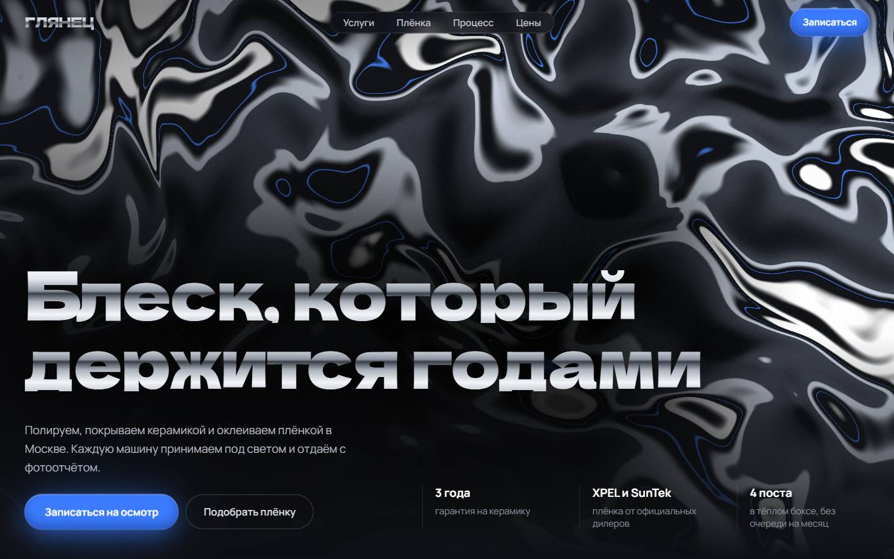 **Detailing studio**: liquid-chrome WebGL hero, 3D wrap-film configurator | 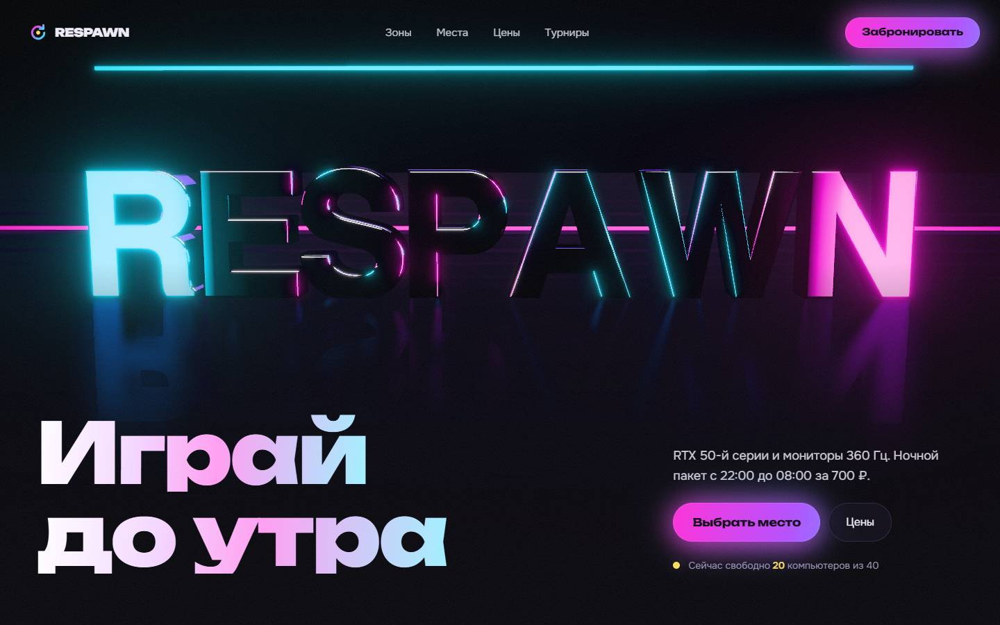 **Computer club**: 3D neon logo, seat booking grid |
| 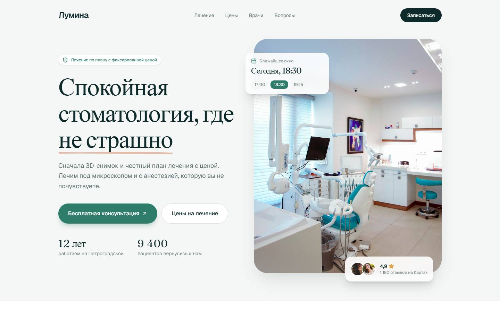 **Dental clinic**: calm editorial layout, online booking | 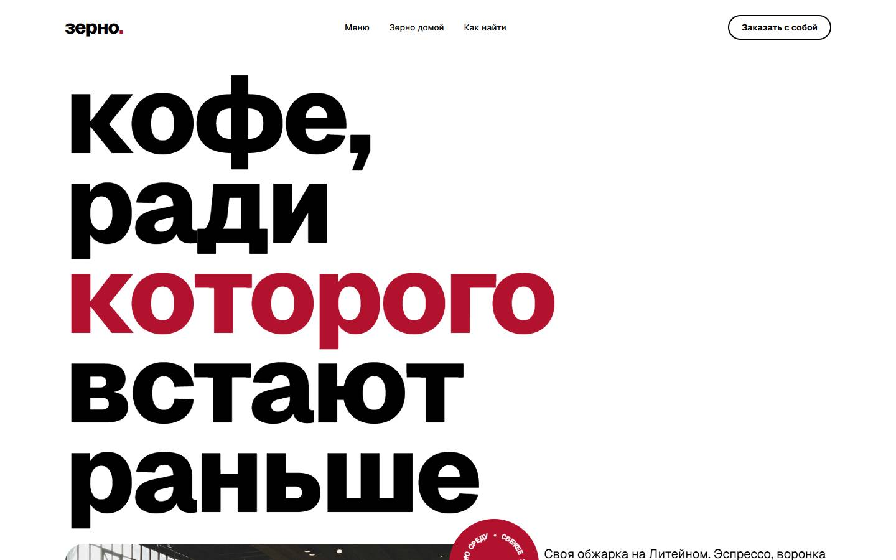 **Coffee roastery**: oversized type, rotating badge, menu columns |
| 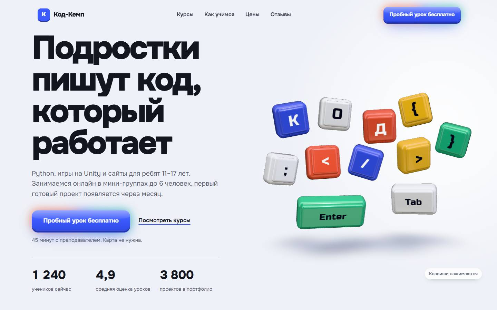 **Coding school**: 3D keyboard, live code block | 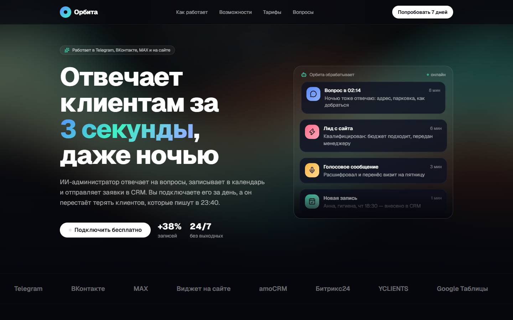 **AI SaaS**: shader background, interactive demos |
| 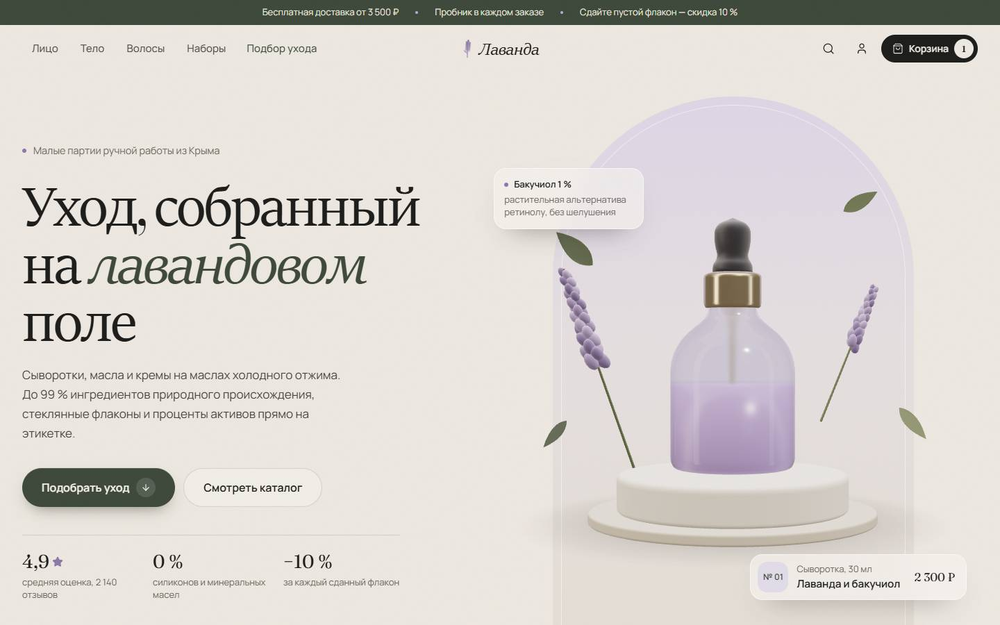 **E-commerce**: catalog, cart, checkout modal | 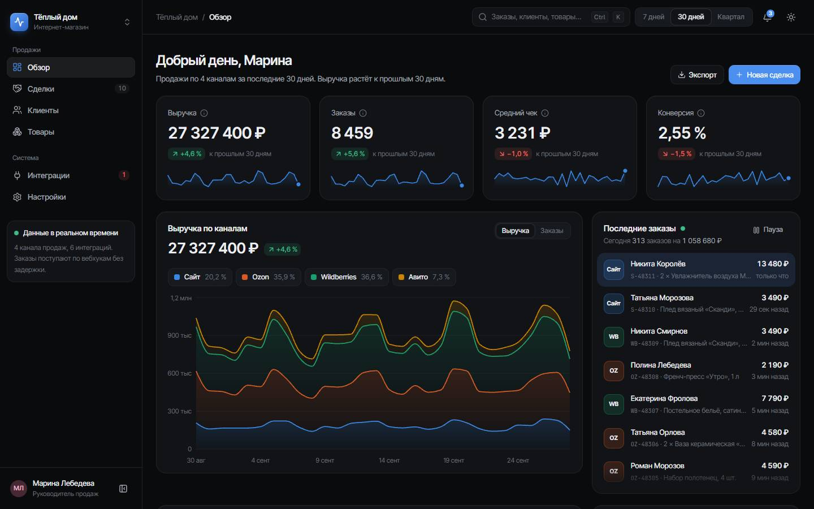 **Sales dashboard**: Recharts, KPI cards, dark UI |
| 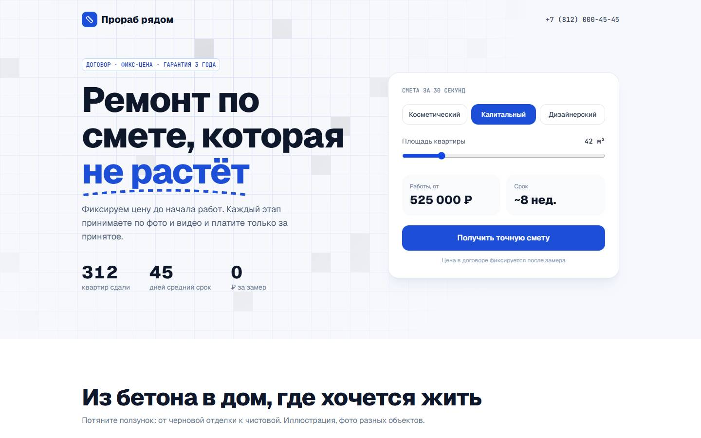 **Renovation company**: estimate calculator | 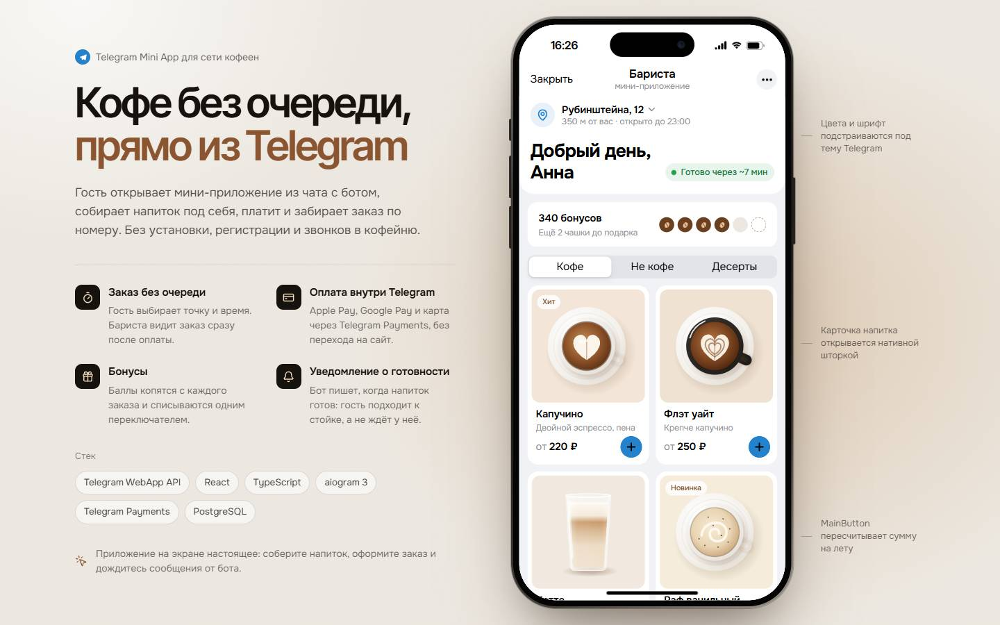 **Telegram Mini App**: order flow for a coffee shop |

Mobile layouts:

<p>
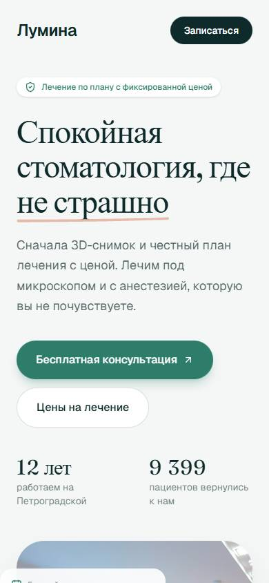 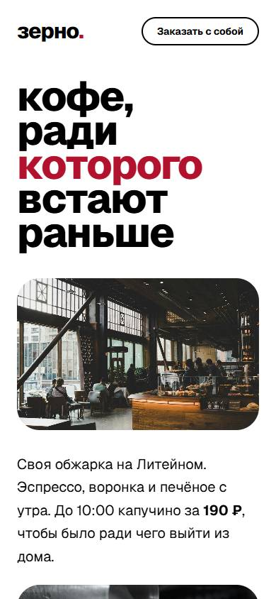 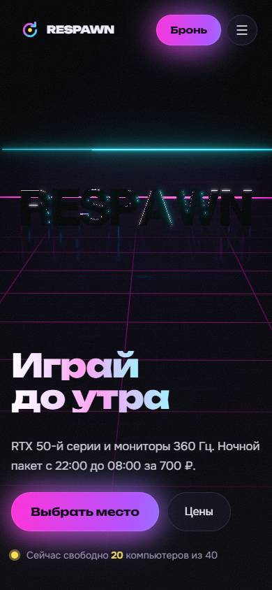 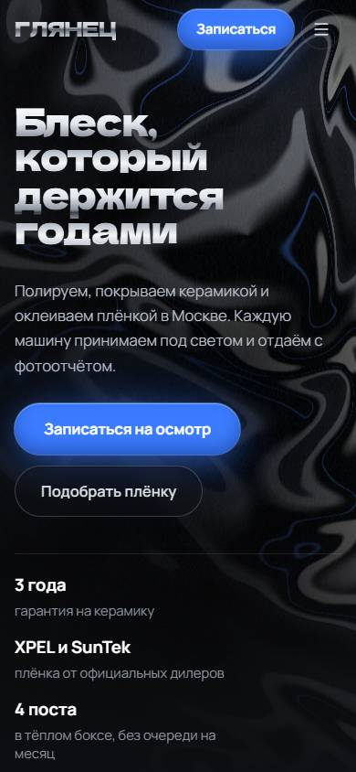 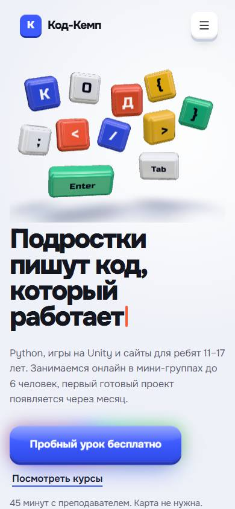
</p>

## Stack

- **UI:** React 19, TypeScript 6, Tailwind CSS 4, shadcn/ui, Radix, Base UI
- **Motion:** GSAP + ScrollTrigger, Framer Motion, Lenis smooth scroll
- **3D and graphics:** Three.js, React Three Fiber, drei, postprocessing, custom GLSL shaders, cobe globe, tsParticles
- **Build:** Vite 8 multi-page build, oxlint, code splitting per page
- **Quality:** respects `prefers-reduced-motion`, keyboard focus states, light assets, audited with the Playwright suite from [web-qa-autotests](https://github.com/YoungOver/web-qa-autotests)

## Structure

```
src/               pages, shared sections, magicui and aceternity based effects
public/img         optimised imagery
scripts/           screenshot and build helpers
*.html             one entry per site
```

## Run

```bash
npm install
npm run dev        # all pages at http://localhost:5173/<page>.html
npm run build      # static multi-page build in dist/
```
